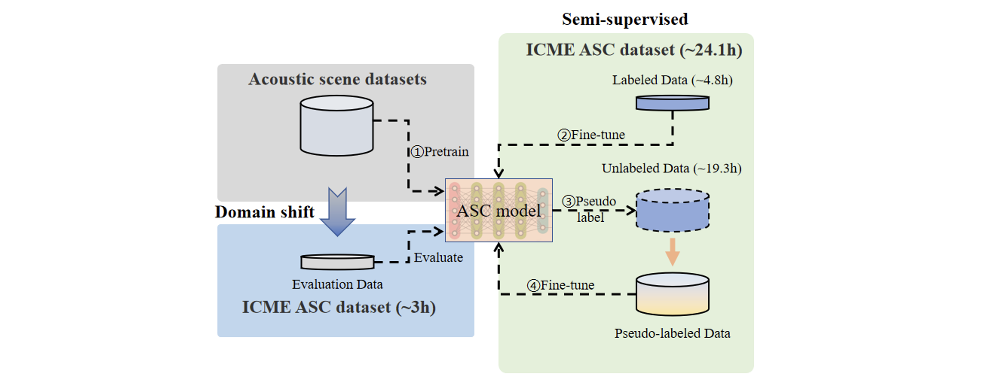

# Semi-supervised Acoustic Scene Classification under Domain Shift

Baseline for IEEE ICME 2024 Grand Challenge.

This Challenge aims to push the boundaries of computational audition by tackling one of its most compelling problems: effectively classifying acoustic scenes under significant domain shifts.

## Challenge Website
[ICME2024 GC](https://2024.ieeeicme.org/grand-challenge-proposals/)  
[Challenge website](https://ascchallenge.xshengyun.com/)  
[Development dataset](https://zenodo.org/records/10616533)  
[Google groups](https://groups.google.com/g/icme2024-gc-asc)

## Official Baseline

**The challenge has started and links to the development dataset and registration are available.**



### Step 1: Python Running Environment
```shell
conda create -n ASC python=3.10
conda activate ASC
git clone git@github.com:JishengBai/ICME2024ASC.git; cd ICME2024ASC
pip install -r requirement.txt
```  

### Step 2: Setup Dataset
This step includes dataset download, unzip, and feature extraction. 
```shell
# Takes about an hour
python3 setup_data.py
# Our dataset is available on Zenodo: xxx.
```

### Step3: Train and Evaluate Model

```shell
# Model training, which includes the following three steps:
# (1) Training with limited labels; (2) Pseudo labeling; (3) Model training with pseudo labels.
# In total the training process takes about 30 minutes on a single NVIDIA 2080 Ti.
python train.py

# Model testing.
python test.py
```
You can find an example training log [here](https://github.com/JishengBai/ICME2024ASC/blob/main/data/example_train.log)

## Cite
```bibtex
@misc{bai2024description,
      title={Description on IEEE ICME 2024 Grand Challenge: Semi-supervised Acoustic Scene Classification under Domain Shift}, 
      author={Jisheng Bai and Mou Wang and Haohe Liu and Han Yin and Yafei Jia and Siwei Huang and Yutong Du and Dongzhe Zhang and Mark D. Plumbley and Dongyuan Shi and Woon-Seng Gan and Susanto Rahardja and Bin Xiang and Jianfeng Chen},
      year={2024},
      eprint={2402.02694},
      archivePrefix={arXiv},
      primaryClass={eess.AS}
}
```
```bibtex
@ARTICLE{9951400,
  author={Bai, Jisheng and Chen, Jianfeng and Wang, Mou and Ayub, Muhammad Saad and Yan, Qingli},
  journal={IEEE Transactions on Cognitive and Developmental Systems}, 
  title={A Squeeze-and-Excitation and Transformer-Based Cross-Task Model for Environmental Sound Recognition}, 
  year={2023},
  volume={15},
  number={3},
  pages={1501-1513},
  keywords={Task analysis;Acoustics;Computational modeling;Speech recognition;Transformers;Pattern recognition;Computer architecture;Attention mechanism;cross-task model;data augmentation;environmental sound recognition (ESR)},
  doi={10.1109/TCDS.2022.3222350}}
```


## Organization
- Northwestern Polytechnical University, China
- Xi'an Lianfeng Acoustic Technologies Co., Ltd., China
- Nanyang Technological University, Singapore
- Institute of Acoustics, Chinese Academy of Sciences, China
- University of Surrey, UK


